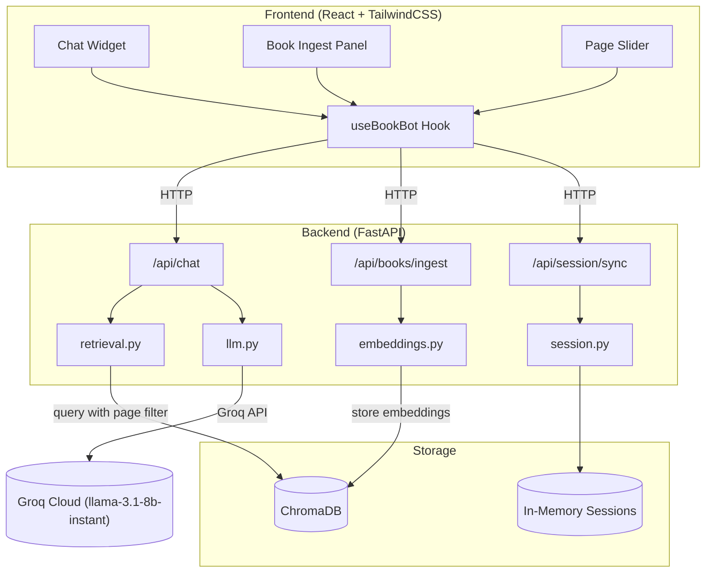
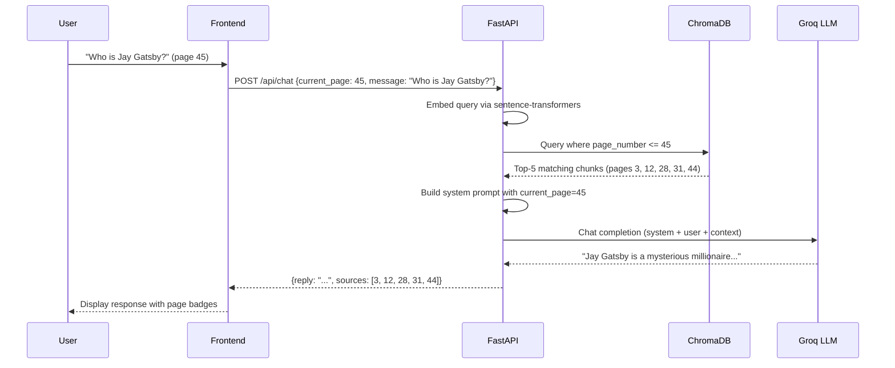

# BookBot — Context-Aware Reading Assistant

Build a full-stack chatbot that reads an entire book, embeds it per-page into ChromaDB, and answers user questions **only** from pages they've already read — never spoiling future content.

## User Review Required

> [!IMPORTANT]
> **TailwindCSS version**: The user requested TailwindCSS. I'll use **TailwindCSS v4** with the new `@tailwindcss/vite` plugin (latest recommended approach). Please confirm this is acceptable.

> [!IMPORTANT]
> **Groq API Key**: You'll need a valid `GROQ_API_KEY` from [console.groq.com](https://console.groq.com). I'll set up `.env` support but the key must be provided before testing.

> [!WARNING]
> **sentence-transformers model download**: On first run, the `all-MiniLM-L6-v2` model (~22 MB) will be auto-downloaded from Hugging Face. This requires internet access.

## Open Questions

1. **PDF vs plain text**: The spec mentions "text or PDF". I'll support both — plain text body in JSON and PDF file upload via multipart form. Does that work?
2. **Local-only**: I'll use ChromaDB (local, persistent) as the vector DB. Pinecone support can be added later. OK?
3. **No real Kindle OAuth**: The Kindle/reading platform integration will be stubbed as a webhook endpoint (`POST /api/session/sync`). Real OAuth requires Amazon developer credentials. Is a stub acceptable for V1?

---

## Proposed Changes

### Backend (FastAPI + Python)

All backend files live in `bookbot/backend/`.

---

#### [NEW] [requirements.txt](file:///c:/Users/LALIT COMPUTER/Desktop/book_reader/bookbot/requirements.txt)
Python dependencies:
- `fastapi`, `uvicorn[standard]`, `python-multipart` — API framework
- `groq` — Groq LLM SDK
- `sentence-transformers` — local embedding model (`all-MiniLM-L6-v2`)
- `chromadb` — local vector DB
- `pypdf` — PDF text extraction
- `python-dotenv` — `.env` loading
- `pydantic` — data validation (bundled with FastAPI)

#### [NEW] [.env.example](file:///c:/Users/LALIT COMPUTER/Desktop/book_reader/bookbot/.env.example)
Template for required environment variables.

---

#### [NEW] [models.py](file:///c:/Users/LALIT COMPUTER/Desktop/book_reader/bookbot/backend/models.py)
Pydantic models:
- `Book` — `book_id`, `title`, `author`, `total_pages`
- `PageChunk` — `page_number`, `content`
- `UserSession` — `user_id`, `book_id`, `current_page`, `last_updated`
- Request/response schemas: `IngestRequest`, `ChatRequest`, `ChatResponse`, `SessionSyncRequest`

#### [NEW] [embeddings.py](file:///c:/Users/LALIT COMPUTER/Desktop/book_reader/bookbot/backend/embeddings.py)
- Loads `all-MiniLM-L6-v2` model (singleton)
- `chunk_text(text: str, book_id: str) -> List[PageChunk]` — splits by page markers or fixed size
- `chunk_pdf(pdf_bytes: bytes, book_id: str) -> List[PageChunk]` — uses `pypdf` to extract per-page text
- `embed_chunks(chunks) -> List[List[float]]` — batch encode via sentence-transformers
- `store_chunks(book_id, chunks, embeddings)` — upserts into ChromaDB with metadata `{book_id, page_number}`

#### [NEW] [retrieval.py](file:///c:/Users/LALIT COMPUTER/Desktop/book_reader/bookbot/backend/retrieval.py)
- `get_chroma_collection(book_id)` — returns or creates the ChromaDB collection
- `retrieve_context(query, book_id, current_page, top_k=5)` — embeds query, queries ChromaDB with `where={"page_number": {"$lte": current_page}}`, returns matching chunks + page numbers
- `get_page_chunk(book_id, page_number)` — direct fetch for "What happened on page X?" queries

#### [NEW] [llm.py](file:///c:/Users/LALIT COMPUTER/Desktop/book_reader/bookbot/backend/llm.py)
- `build_system_prompt(book_title, author, current_page, retrieved_context)` — assembles the anti-spoiler system prompt (as specified in the user's spec)
- `chat_with_groq(system_prompt, user_message) -> str` — calls `groq.Groq().chat.completions.create()` with model `llama-3.1-8b-instant`
- Streaming support via `stream=True` for real-time token delivery

#### [NEW] [session.py](file:///c:/Users/LALIT COMPUTER/Desktop/book_reader/bookbot/backend/session.py)
- In-memory dict `sessions: Dict[str, UserSession]` (V1, can be upgraded to Redis/DB later)
- `get_session(user_id, book_id) -> UserSession`
- `update_session(user_id, book_id, current_page)`
- Also stores book metadata (title, author, total_pages) when ingested

#### [NEW] [main.py](file:///c:/Users/LALIT COMPUTER/Desktop/book_reader/bookbot/backend/main.py)
FastAPI app with CORS middleware and endpoints:

| Endpoint | Method | Purpose |
|---|---|---|
| `/api/books/ingest` | POST | Accept JSON body (text) or PDF upload → chunk → embed → store |
| `/api/chat` | POST | Accept `{user_id, book_id, current_page, message}` → retrieve context (filtered) → LLM → respond |
| `/api/session/{user_id}/{book_id}` | GET | Return current reading progress |
| `/api/session/sync` | POST | Webhook: update `current_page` in real-time |
| `/api/books` | GET | List all ingested books |

Special query detection in `/api/chat`:
1. If message matches "summarize" pattern → retrieve pages 1 through `current_page` (sampled) → summary prompt
2. If message matches "page X" pattern → direct page fetch → explain prompt
3. If message matches "catch me up" → retrieve recent 20 pages → recap prompt
4. Default → semantic search with `$lte` filter → general Q&A

---

### Frontend (React + Vite + TailwindCSS)

All frontend files live in `bookbot/frontend/`.

---

#### [NEW] Vite + React project scaffold
Created via `npx -y create-vite@latest ./ --template react` inside `bookbot/frontend/`, then install `tailwindcss @tailwindcss/vite`.

#### [NEW] [vite.config.js](file:///c:/Users/LALIT COMPUTER/Desktop/book_reader/bookbot/frontend/vite.config.js)
Configure `@vitejs/plugin-react` + `@tailwindcss/vite` plugins. Proxy `/api` to FastAPI backend on `:8000`.

#### [NEW] [src/index.css](file:///c:/Users/LALIT COMPUTER/Desktop/book_reader/bookbot/frontend/src/index.css)
`@import "tailwindcss";` + custom design tokens:
- Dark mode color palette (deep navy/purple gradients)
- Glassmorphism utility classes
- Custom scrollbar styling
- Smooth animations for chat bubbles

#### [NEW] [src/App.jsx](file:///c:/Users/LALIT COMPUTER/Desktop/book_reader/bookbot/frontend/src/App.jsx)
Main layout:
- Full-screen dark gradient background
- Floating chat widget (centered or sidebar)
- Book selector / page input controls
- Ingest book panel (collapsible)

#### [NEW] [src/components/ChatWidget.jsx](file:///c:/Users/LALIT COMPUTER/Desktop/book_reader/bookbot/frontend/src/components/ChatWidget.jsx)
Premium chat UI:
- Glassmorphic chat container with backdrop blur
- Message bubbles with subtle slide-in animations
- User messages (right-aligned, gradient accent) vs Bot messages (left-aligned, darker glass)
- Typing indicator with animated dots
- Source page badges on bot responses
- Auto-scroll to latest message
- Input bar with send button + keyboard shortcuts

#### [NEW] [src/components/BookIngest.jsx](file:///c:/Users/LALIT COMPUTER/Desktop/book_reader/bookbot/frontend/src/components/BookIngest.jsx)
Book upload panel:
- Drag & drop PDF zone or paste text
- Book metadata fields (title, author)
- Progress indicator during ingestion
- Success/error toast notifications

#### [NEW] [src/components/PageSlider.jsx](file:///c:/Users/LALIT COMPUTER/Desktop/book_reader/bookbot/frontend/src/components/PageSlider.jsx)
- Range slider to set/sync current page
- Shows "Page X of Y" label
- Triggers session sync on change

#### [NEW] [src/hooks/useBookBot.js](file:///c:/Users/LALIT COMPUTER/Desktop/book_reader/bookbot/frontend/src/hooks/useBookBot.js)
Custom hook:
- `ingestBook(formData)` — POST to `/api/books/ingest`
- `sendMessage(chatRequest)` — POST to `/api/chat`
- `getSession(userId, bookId)` — GET session
- `syncPage(userId, bookId, page)` — POST to `/api/session/sync`
- `listBooks()` — GET `/api/books`
- Loading/error state management

---

### Scripts & Configuration

#### [NEW] [ingest_book.py](file:///c:/Users/LALIT COMPUTER/Desktop/book_reader/bookbot/scripts/ingest_book.py)
CLI script to ingest a book from a local file:
```
python scripts/ingest_book.py --file book.pdf --title "The Great Gatsby" --author "F. Scott Fitzgerald"
```

#### [NEW] [.env.example](file:///c:/Users/LALIT COMPUTER/Desktop/book_reader/bookbot/.env.example)
```
GROQ_API_KEY=your_key_here
GROQ_MODEL=llama-3.1-8b-instant
EMBEDDING_MODEL=all-MiniLM-L6-v2
CHROMA_PERSIST_DIR=./chroma_data
```

---

## Architecture Diagram



---

## Anti-Spoiler Flow



---

## Verification Plan

### Automated Tests
1. **Backend startup**: `uvicorn bookbot.backend.main:app` starts without errors
2. **Ingest endpoint**: POST a sample text → verify chunks stored in ChromaDB
3. **Chat endpoint**: POST a query with `current_page=5` → verify response only references pages ≤ 5
4. **Anti-spoiler filter**: Query ChromaDB directly and confirm no results from pages > `current_page`
5. **Frontend build**: `npm run dev` serves the UI without errors

### Manual Verification
1. Ingest a sample book (e.g., a public domain text)
2. Set current page to a midpoint
3. Ask spoiler-prone questions and verify BookBot refuses to reveal future content
4. Use the page slider and verify session sync works
5. Visual check: UI should look premium with dark theme, glassmorphism, animations

### Browser Testing
- Open the frontend in browser
- Test the full flow: ingest → set page → chat → verify anti-spoiler behavior
- Verify responsive layout and animations
